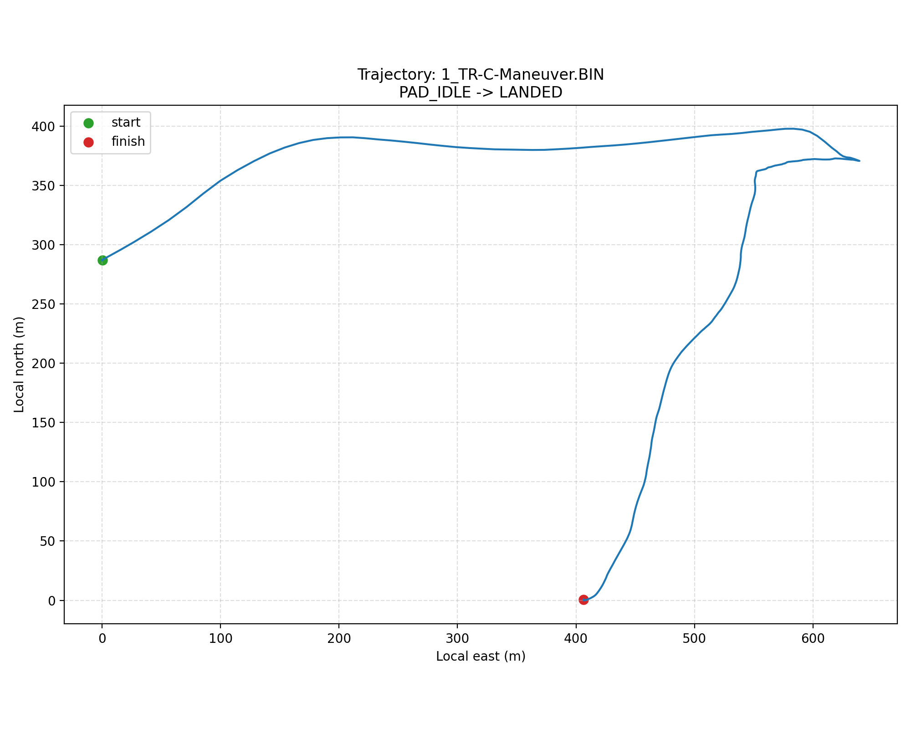
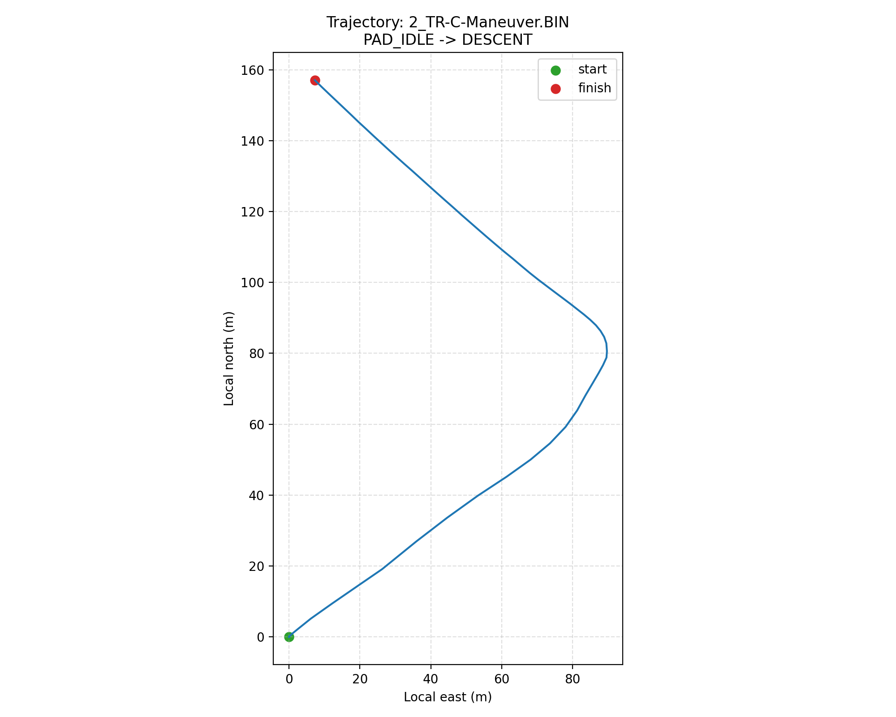
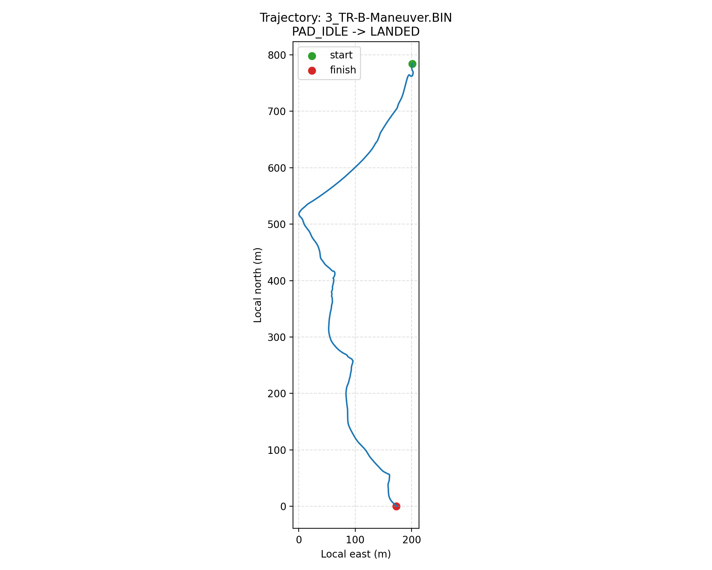

# ArduPilot Log Dataset

Набір містить `DataFlash`/`BIN` логи польотів ArduPilot та прості Python-скрипти для їх аналізу через `pymavlink`.

## Приклади траєкторій

### 1_TR-C-Maneuver



### 2_TR-C-Maneuver



### 3_TR-B-Maneuver



## Швидкий старт

Створення середовища та встановлення залежностей:

```bash
python3 -m venv .venv
source .venv/bin/activate
pip install -r requirements.txt
```

Побудова траєкторії:

```bash
python plot_trajectory.py --start-stage BOOST --end-stage APOGEE
```

## Backend (FastAPI + PostgreSQL + Docker)

Для задачі також підготовлено стартовий backend у папці `backend/`.

Швидкий запуск:

```bash
cd backend
docker compose up --build
```

Стек піднімає `api + worker + redis + postgres`.
PostgreSQL проброшений на `localhost:5433`, щоб уникнути конфлікту з локальним `5432`.

Детальна інструкція та API: `backend/README.md`.

## Як працювати з логами через Python

### 1. Зчитати GPS точки

Нижче приклад, який читає `GPS` повідомлення та витягує широту, довготу, висоту і тип GPS fix:

```python
from pymavlink import mavutil

log = mavutil.mavlink_connection("1_TR-C-Maneuver.BIN")

gps_points = []
while True:
    msg = log.recv_match(type="GPS", blocking=False)
    if msg is None:
        break

    data = msg.to_dict()
    gps_points.append(
        {
            "time_us": data["TimeUS"],
            "gps_instance": data["I"],
            "status": data["Status"],
            "lat": data["Lat"],
            "lng": data["Lng"],
            "alt_m": data["Alt"],
        }
    )

print(f"GPS samples: {len(gps_points)}")
print(gps_points[:3])
```

Що тут важливо:

- `TimeUS` — час запису в мікросекундах від старту системи.
- `I` — інстанс GPS сенсора.
- `Status` — тип GPS fix.
- `Lat`, `Lng`, `Alt` — координати та висота.

### 2. Зчитати raw IMU дані

У цих логах raw IMU доступний через повідомлення `ACC` та `GYR`. Кожен запис містить індекс сенсора `I`.

```python
from pymavlink import mavutil

log = mavutil.mavlink_connection("1_TR-C-Maneuver.BIN")

acc_samples = {0: [], 1: [], 2: []}

while True:
    msg = log.recv_match(type="ACC", blocking=False)
    if msg is None:
        break

    data = msg.to_dict()
    imu_id = int(data["I"])
    acc_samples.setdefault(imu_id, []).append(
        {
            "time_us": data["TimeUS"],
            "sample_us": data["SampleUS"],
            "x": data["AccX"],
            "y": data["AccY"],
            "z": data["AccZ"],
        }
    )

for imu_id, samples in acc_samples.items():
    print(f"ACC[{imu_id}] samples: {len(samples)}")
```

Аналогічно для гіроскопа:

```python
from pymavlink import mavutil

log = mavutil.mavlink_connection("1_TR-C-Maneuver.BIN")

while True:
    msg = log.recv_match(type="GYR", blocking=False)
    if msg is None:
        break

    data = msg.to_dict()
    print(
        data["I"],
        data["TimeUS"],
        data["GyrX"],
        data["GyrY"],
        data["GyrZ"],
    )
    break
```

Що тут важливо:

- `ACC` — сирі акселерометри.
- `GYR` — сирі гіроскопи.
- `I` — номер IMU сенсора.
- `SampleUS` — точний час вибірки для raw IMU.

## Повідомлення FSTG

У логах також є повідомлення `FSTG` (`Flight Stage`), яке описує переходи між етапами польоту. Воно корисне, коли потрібно аналізувати не весь лог, а лише реальну польотну ділянку.

Типові стадії:

- `1` — `PAD_IDLE`
- `2` — `BOOST`
- `3` — `COAST`
- `4` — `APOGEE`
- `5` — `DESCENT`
- `6` — `LANDED`

Основні поля `FSTG`:

- `TimeUS` — час запису повідомлення в мікросекундах
- `Stg` — нова стадія польоту
- `PStg` — попередня стадія
- `BstS` — час початку boost
- `BstC` — час підтвердження boost
- `StgE` — час входу в стадію
- `DDly` — detection delay

Практично `FSTG` можна використовувати так:

- знайти момент початку реального польоту, наприклад від `PAD_IDLE` або `BOOST`
- обмежити аналіз GPS/IMU тільки інтервалом між стадіями, наприклад `BOOST -> APOGEE`
- відокремити політ від передстартового запису, коли контролер уже пише лог, але апарат ще не злетів

Приклад читання `FSTG` через `pymavlink`:

```python
from pymavlink import mavutil

log = mavutil.mavlink_connection("1_TR-C-Maneuver.BIN")

while True:
    msg = log.recv_match(type="FSTG", blocking=False)
    if msg is None:
        break

    data = msg.to_dict()
    print(
        data["TimeUS"],
        data["PStg"],
        "->",
        data["Stg"],
        "delay:",
        data["DDly"],
    )
```

Саме таке повідомлення використовується в `plot_trajectory.py`, щоб будувати траєкторію не по всьому логу, а тільки між вибраними стадіями польоту.

## Корисний інструмент для читання логів

- UAV Log Viewer: https://plot.ardupilot.org/

## Скрипт у репозиторії

- `plot_trajectory.py` — будує траєкторії з GPS по всіх або вибраних логах.

## Офіційна документація

- ArduPilot Logs: https://ardupilot.org/plane/docs/common-logs.html
- ArduPilot Onboard Message Log Messages: https://ardupilot.org/plane/docs/logmessages.html
- UAV Log Viewer: https://plot.ardupilot.org/
- MAVLink / Pymavlink guide: https://mavlink.io/en/mavgen_python/
- Pymavlink repository: https://github.com/ArduPilot/pymavlink
